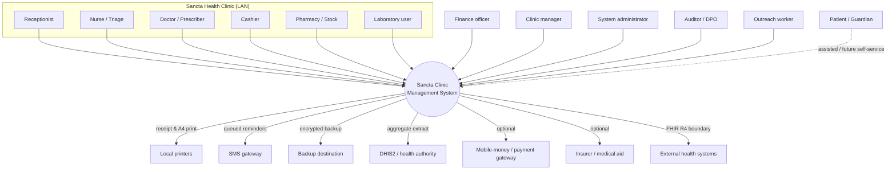
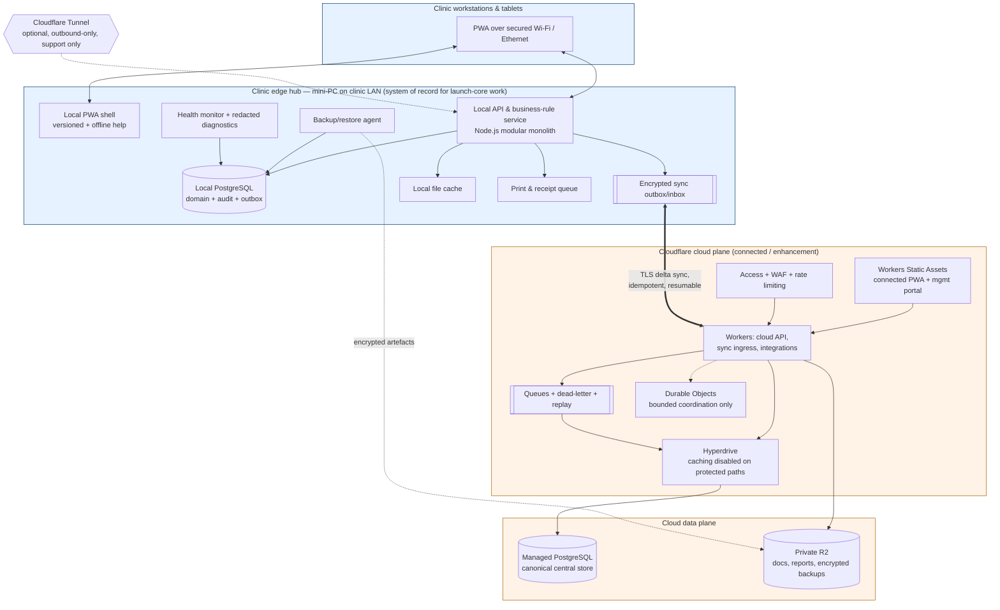
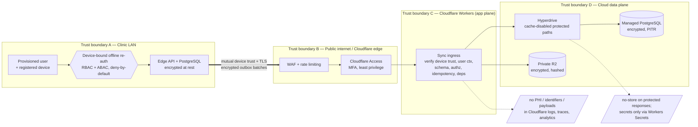

# Architecture diagrams

Context, deployment and trust-boundary views (pack §14 step 4). Rendered with Mermaid.

## 1. Context diagram

Who and what interacts with the system.

## 2. Deployment diagram

Offline-first hybrid: clinic edge + Cloudflare cloud plane.

**Boundary rule:** internet or Cloudflare loss must not stop authorised LAN work
(NFR-038). The edge hub keeps authenticating provisioned users, saving transactions,
printing, closing the cashier and queuing sync for ≥72 h (NFR-001).

## 3. Trust-boundary diagram

Where identity, encryption and authorisation change hands.

Boundary controls: unique users, no shared accounts, MFA for privileged/remote access,
offline device-bound re-auth, registered-device trust + revocation + inactivity lock,
break-glass with reason + retrospective review, TLS 1.2+ in transit, strong encryption at
rest everywhere, tamper-evident audit, and PHI kept out of all platform telemetry
(pack §17).
